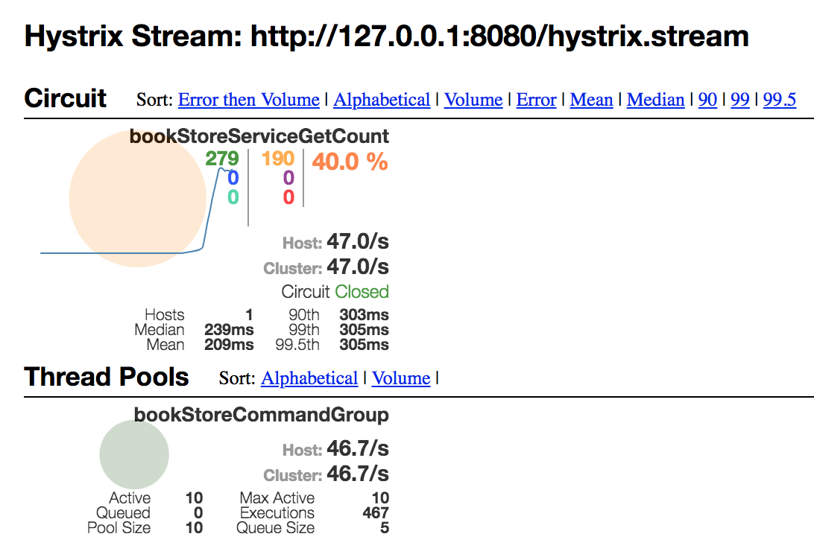

# # hystrix-demo

主要希望通过本demo来介绍[Hystrix](https://github.com/Netflix/Hystrix/wiki)的使用, 在我看来, 这个类库可能是当前最为重要的类库之一

不管是其引入的断路器的概念还是其使用, 都是一个现代技术堆栈中必须的, 也是当下程序员需要熟练掌握的技术.


## demo介绍

首先, 按照一个spring boot程序的方式启动, 本demo没有任何其他需要依赖的资源.


然后可以执行

```
curl http://127.0.0.1:8080/count-with-hystrix
```

从这里可以看到返回值是一个不断递增的数字, 具体实现参见 `com.easemob.demo.hystrixdemo.service.BookStoreServiceImpl#getBookCount`

 如果看服务的日志输出的话, 可以看到

```
2018-06-14 01:29:55.286 DEBUG 6061 --- [nio-8080-exec-9] c.e.d.h.rest.RestDemoController          : running into /count-with-hystrix api call,
	 这个command是否成功执行 : true
	 当前断路器是否打开: false
	 返回值是否走的fallback: false
	 请求是否超时: false
	 这个command的执行时间是 1毫秒
```

### 模拟后端服务超时

可以执行 `curl http://127.0.0.1:8080/count-with-hystrix?sleep=1000`

其中`sleep`参数表示让后端的服务模拟执行耗时需要1s的情况, 这时候可以看到这个请求的返回值为`-1`, 状态码为200,

 并且可以在程序的日志中看到

```
2018-06-14 01:34:31.565 ERROR 6061 --- [eCommandGroup-6] c.e.d.h.service.BookStoreServiceImpl     : sleep in getBookCount was interrupted
2018-06-14 01:34:31.565 DEBUG 6061 --- [nio-8080-exec-7] c.e.d.h.rest.RestDemoController          : running into /count-with-hystrix api call,
	 这个command是否成功执行 : false
	 当前断路器是否打开: false
	 返回值是否走的fallback: true
	 请求是否超时: true
	 这个command的执行时间是 303毫秒
```

从日志中可以看到, 这个请求在hystrix看来是超时了, 整个command的执行时间为303毫秒

这是因为在application.properties中有`hystrix.command.bookStoreServiceGetCount.execution.isolation.thread.timeoutInMilliseconds=300`这个配置, 也就是指定了这个command的超时时间为300毫秒, 而上面我们在模拟1s的情况, 所以会超时, 但是这时候hystrix的fallback机制起作用了, 所以我们看到的http请求是200成功, 并得到了fallback的值-1 (参见com.easemob.demo.hystrixdemo.service.GetBookCountHystrixCommand#getFallback)

### 模拟后端服务异常

可以执行`curl http://127.0.0.1:8080/count-with-hystrix?exception=true`

其中, exception的参数可以让后端服务来模拟抛出异常的情况, 可以看到这个时候, 我们的http的response依然是-1, 并且状态码是200

但是在日志中, 可以看到这个返回值也都了fallback

```
2018-06-14 01:37:51.197 DEBUG 6061 --- [nio-8080-exec-9] c.e.d.h.rest.RestDemoController          : running into /count-with-hystrix api call,
	 这个command是否成功执行 : false
	 当前断路器是否打开: false
	 返回值是否走的fallback: true
	 请求是否超时: false
	 这个command的执行时间是 1毫秒
```


### 使用wrk模拟压测

[GitHub - wg/wrk: Modern HTTP benchmarking tool](https://github.com/wg/wrk) 是一个常见的类似ab的压测工具, 我们可以在本机模拟不停的发请求

mac上面使用brew安装 `brew install wrk`, 具体wrk的使用请参考wrk自己的文档, 很简单, 在此不做详述.


首先在本机的浏览器中打开[Hystrix Dashboard](http://127.0.0.1:8080/hystrix), 并在界面中填写`http://127.0.0.1:8080/hystrix.stream`

然后在命令行执行

`wrk -c 10 -d 20s -t 10 http://127.0.0.1:8080/count-with-hystrix?randomsleep=true`

这里的`randomsleep`参数会让后端服务对每个请求随机产生*0-500*毫秒的延迟, 来模拟现实情况, 这时候可以在上面的网页中看到hystrix起的作用


> 最好调整application.properties中的logging.level.com.easemob.demo.hystrixdemo.rest.RestDemoController=debug 为info级别, 不然日志太多,机器相应慢


## Hystrix  介绍

简单来说, hystrix提供了一个简单且优雅的方案来让你的系统实现自动降级和恢复.


以环信客服系统为例, 有两个典型的场景, *排队*和*调度*


当有访客请求坐席服务的时候, 会根据访客请求的服务类型不同, 把访客放到某一个服务队列中进行排队.

每个服务队列都对应了一个技能组(为了讨论方便进行了简化), 每个技能组又包括了一个到多个坐席人员.

当服务队列中排队的人数增加的时候( 例如有新的访客到达了 ), 系统会通知在这个技能组中的所有的坐席人员(通过websocket或者app端的长连接), 坐席工作台收到这个通知之后, 会调用系统的 `/count`接口来请求当前这个服务队列中等待服务的访客人数, 从而在界面上显示给坐席人员看到当前的队列长度.


当坐席人员有能力接待的时候, 系统又会根据不同的调度算法, 从当前的排队队列中, 选择一个等待的访客分配给这个坐席, 从而会把这个访客从服务队列中移除掉, 进而又会通知到坐席工作台, 坐席工作台又会请求`/count`接口来刷新当前的待服务人数.

所以, 假设只有一个服务队列( 即一个技能组), 这个服务队列每秒有100个访客到达, 这个技能组有50个坐席在线提供服务, 那么可知, 每秒100服务队列变化的通知发送到这50个坐席的工作台, 然后这50个坐席工作台会发出 `50*100`, 即 *5000* 个对`/count`的请求.


(当然实际情况并不是如此, 例如, 前端可以做throttle限流, 每秒发出一个相同的请求即可, 因为即使每秒发出50个, 那么变化的数字太快也没有意义, 这里为了demo讲解做了简化)


假设所有数据都是存放在一个数据库中的, 从上面的描述, 我们可以看到对数据库的操作分为:

* 写入服务队列
* 从服务队列删除
* 查询队列长度
* 调度(由于调度算法复杂, 会涉及比较复杂数据库查询)

另外, 从业务的角度, 我们还知道如下的信息

* 系统的核心是入队, 出队和调度
* 查询服务队列长度为非核心功能

即, 如果系统压力大, 优先需要保障业务进行, 查看待服务人数的功能可以放弃


## Hystrix Dashboard



Hystrix还提供了一个非常精致美观的[dashboard](https://github.com/Netflix-Skunkworks/hystrix-dashboard),可以让我们用来观察每个hystrix command的执行情况, 具体的界面的信息可以参考上面链接中的介绍

并且, spring cloud还提供了对hystrix dashboard的支持, 只需要在pom文件中加上下面这两个依赖

```

		<dependency>
			<groupId>org.springframework.cloud</groupId>
			<artifactId>spring-cloud-starter-hystrix-dashboard</artifactId>
		</dependency>
        <dependency>
            <groupId>org.springframework.boot</groupId>
            <artifactId>spring-boot-starter-actuator</artifactId>
        </dependency>

```


并且加上`@EnableHystrixDashboard`这个annotation就可以看到了

```
@SpringBootApplication
@EnableHystrix
@EnableHystrixDashboard
public class HystrixDemoApplication {

    public static void main(String[] args) {
        SpringApplication.run(HystrixDemoApplication.class, args);
    }
}

```

然后可以访问`http://127.0.0.1:8080/hystrix`, 在打开的界面上填写上`http://127.0.0.1:8080/hystrix.stream`就可以看到精美的dashboard了

需要注意的是, 如果使用上面的方法, 那么只能在dashboard中看到本机这个单个实例的hystrix command执行状况, 对于生产环境上, 部署多个实例的时候, 意义就
不那么大了, 这个时候, 我们需要使用[Netflix Trubin](https://cloud.spring.io/spring-cloud-static/Edgware.SR3/single/spring-cloud.html#_turbine)
先来聚合这些hystrix command的数据, 并在上面dashboard的地址中填写trubin的地址就可以了.

详细信息可以参考[spring cloud文档](https://cloud.spring.io/spring-cloud-static/Edgware.SR3/single/spring-cloud.html#_circuit_breaker_hystrix_dashboard)
